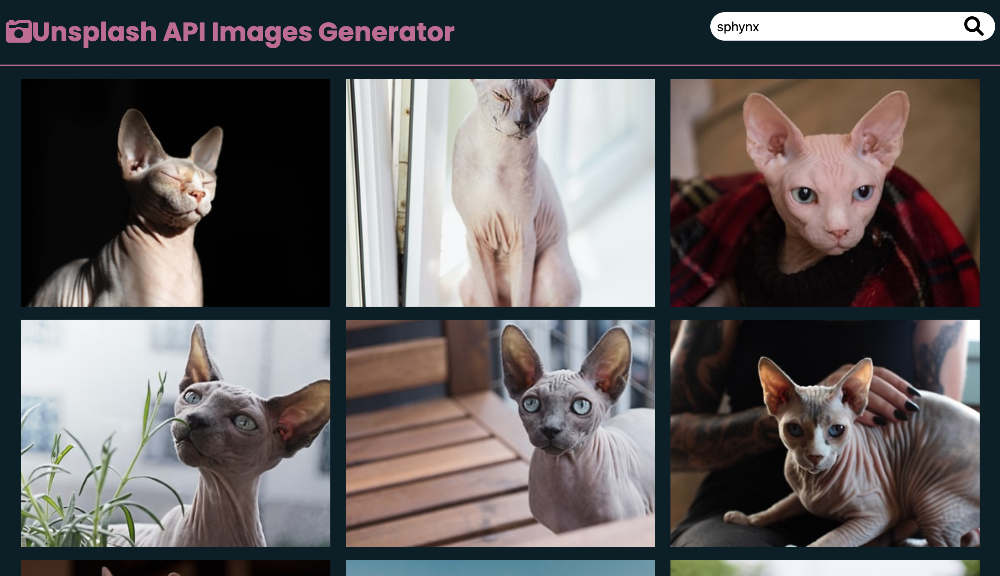

# Gallery Image/API from UNSPLASH[]

## Overview

Users should be able to:

- View the optimal layout for each page depending on their device's screen size
- See hover states for all interactive elements on the page
- Search images on the search box
- Click on images to Download

### Screenshot

### Links

- Live Site URL: [site URL here]()

## My process

### Built with

- Semantic HTML5 markup
- CSS custom properties
- Flexbox
- Mobile-friendly
- Vanilla JavaScript
- UNSPLASH-API

## Author

- linkedin - [Tamiris Cristine](https://www.linkedin.com/in/tamiris-cristine/)
